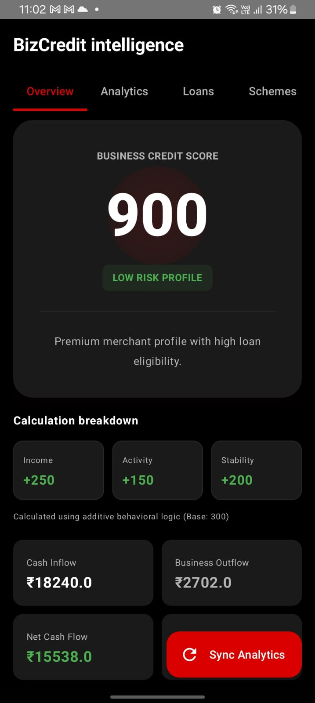
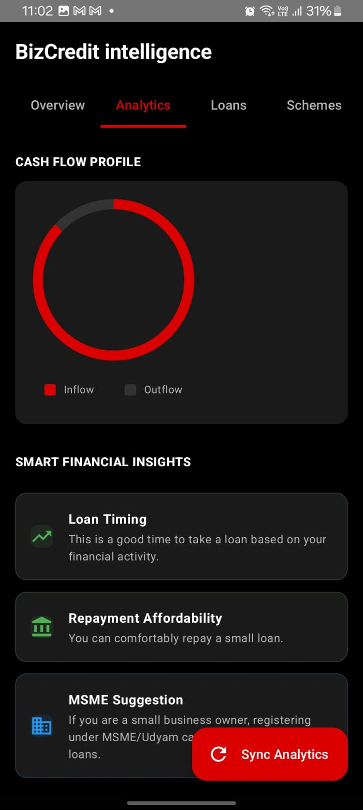
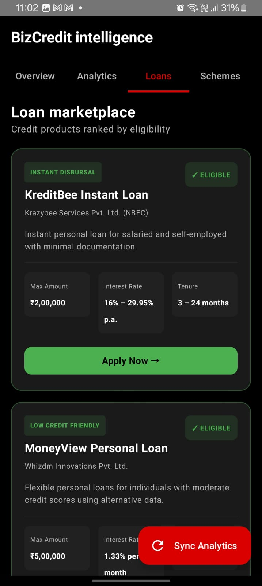
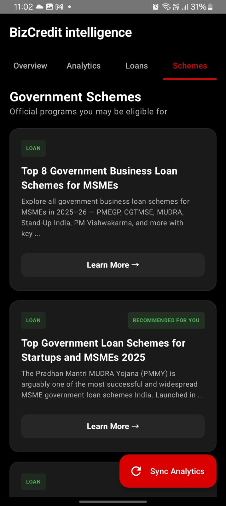

<div align="center">


# 💳 BizCredit
### Smart Financial Opportunity Engine for Small Merchants

> 🏆 **Built for [CodeQuest Hackathon 2026](https://github.com/Yaser-123/SMS-READER)**  
> 👥 **Team: CodeVizards** — *T Mohamed Yaser*

[](https://developer.android.com/)
[](https://nodejs.org/)
[](https://supabase.com/)
[](https://deepmind.google/technologies/gemini/)
[](LICENSE)

[📲 Download APK](https://drive.google.com/file/d/1L4lLhZKU3NqedtYD7APfCSHhu8IrGuB_/view?usp=sharing) • [🔗 LinkedIn](https://www.linkedin.com/in/mohamedyaser08/) • [📧 Contact](mailto:1ammar.yaser@gmail.com)

</div>

---

## 🎯 The Problem

Millions of small merchants — chai-walas, kirana stores, street vendors — process hundreds of UPI transactions every day. Yet they remain invisible to the formal financial system:

- 📵 **No formal credit trail** — Banks don't recognize UPI activity as proof of income
- 💸 **No access to loans** — Without a credit score, formal lending is out of reach
- 🏛 **Missed government schemes** — MSME subsidies and Mudra loans go unclaimed due to lack of awareness

BizCredit fixes this.

---

## 💡 Our Solution

BizCredit is a **decentralized financial intelligence layer** that lives right on the merchant's phone — reading existing SMS data to build a verified financial identity from the ground up.

```
UPI SMS  →  Parse  →  BizCredit Score  →  Loan & Scheme Discovery  →  Action
```

No bank login. No PDF uploads. No friction.

---

## ✨ Features

| Feature | Description |
|---|---|
| 📊 **Real-time Credit Scoring** | Dynamic BizCredit Score (out of 900) updated with every transaction |
| 💰 **Smart Loan Marketplace** | Eligible loan products ranked by your score |
| 🏛 **Government Scheme Discovery** | Personalized MSME, Mudra, and subsidy recommendations |
| 📈 **Analytics Dashboard** | Visualize cash inflow, outflow, and net stability |
| 📄 **Shareable Income Statement** | One-tap professional financial summary for lenders |
| 🔔 **Smart Notifications** | Real-time alerts for eligibility spikes and score changes |

---

## 🖼 Screenshots

<div align="center">

| Dashboard | Analytics | Loans | Schemes |
|:---:|:---:|:---:|:---:|
|  |  |  |  |

</div>

---

## ⚙️ Tech Stack

| Layer | Technology |
|---|---|
| **Frontend** | Android (Kotlin, Jetpack Compose, Material 3) |
| **Backend** | Node.js + Express (REST API) |
| **Database** | Supabase (transactions & user profiles) |
| **Discovery** | Serper.dev (live Google Search integration) |
| **AI** | Gemini 2.5 Flash-Lite (parsing & personalization) |

---

## 🛠 How It Works

```
1. READ    →  App reads incoming UPI SMS filtered by bank headers
2. PARSE   →  Node.js backend extracts merchant, amount, and credit/debit type
3. SCORE   →  Additive behavioral logic generates a BizCredit Score out of 900
4. DISCOVER → Backend queries Serper for live schemes, filtered by Gemini
5. NUDGE   →  Local notifications fire when eligibility thresholds are crossed
```

---

## 🚀 Getting Started

### Backend

```bash
cd backend
npm install

# Set up environment variables
cp .env.example .env
# Add your SERPER_API_KEY and GEMINI_API_KEY

npm start
```

### Android

1. Open the project in **Android Studio Hedgehog or later**
2. Connect a physical device or emulator
3. Update `BASE_URL` in `SmsRepository.kt` to your local machine IP
4. Hit **Run ▶️**

---

## 📲 Try It Now

👉 **[Download BizCredit APK](https://drive.google.com/file/d/1L4lLhZKU3NqedtYD7APfCSHhu8IrGuB_/view?usp=sharing)**

---

## 🔮 Roadmap

- [ ] Account Aggregator (AA) API integration for deeper verification
- [ ] Multi-lingual UI — Hindi, Tamil, Telugu, and more
- [ ] On-device ML scoring for 100% privacy-first operation
- [ ] Direct lender partnerships for instant disbursement

---

## 🏆 Why BizCredit Wins

> **Zero Friction** — Works entirely on existing SMS. No new accounts. No documents.  
> **Financial Inclusion** — Designed specifically for underserved Bharat.  
> **Proactive Intelligence** — Doesn't just show data; it *finds money* for the user.

---

## 👤 Team CodeVizards

**T Mohamed Yaser** — Developer & Designer

Built with ❤️ for *CodeQuest Hackathon 2026*, because every chai-wala deserves a credit score.

[](https://www.linkedin.com/in/mohamedyaser08/)
[](mailto:1ammar.yaser@gmail.com)

